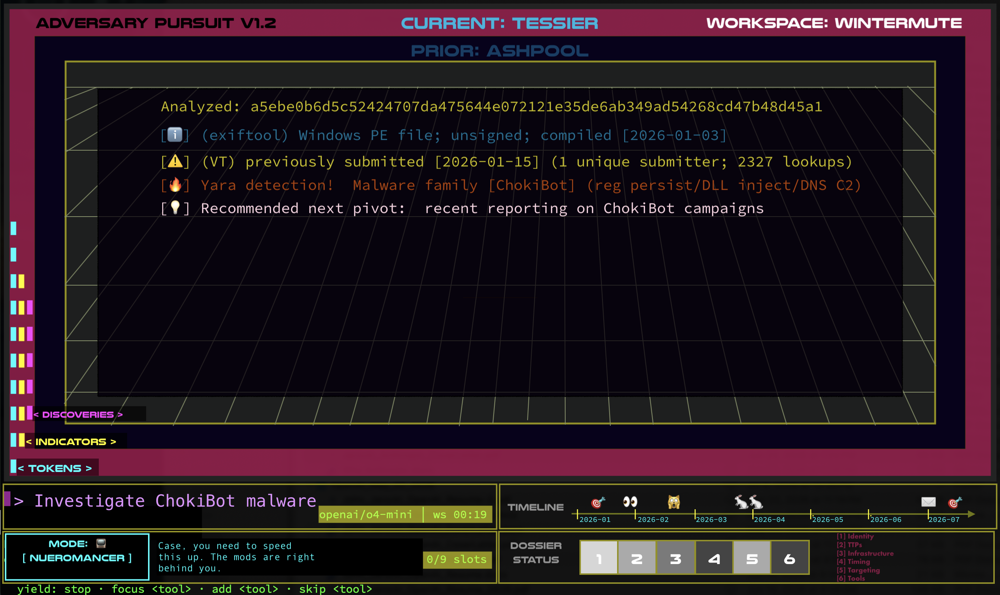
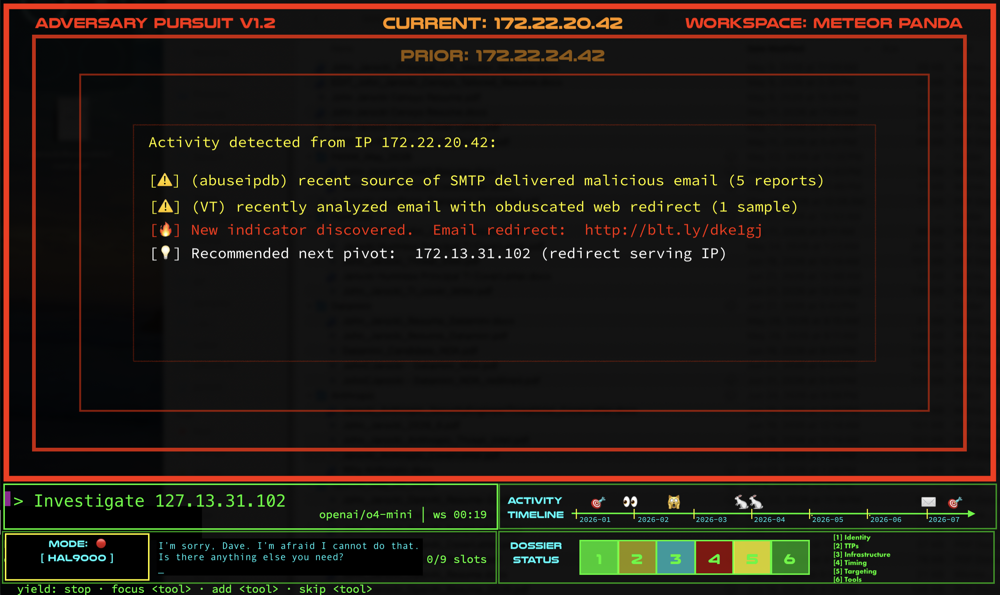
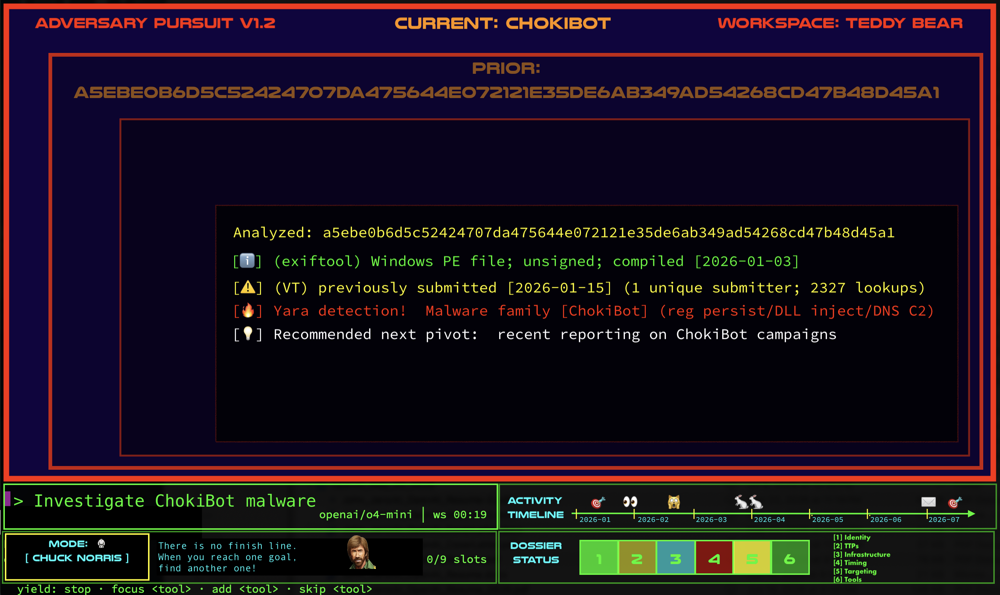

# Pivotglass

Pivotglass (formerly Adversary Pursuit / AP) is an AI-augmented cockpit for hunting, pivoting, and
discovering adversary infrastructure, indicators, and TTPs. It combines
deterministic OSINT/CTI collection, STIX 2.1 evidence, investigation workspaces,
and gamification with an LLM used for tool selection, synthesis, and genuine
analytical reasoning.

The primary interface is simply:

```console
$ ap
```

Bare `ap` starts a loopback-only local web server and opens the React/Next.js
cockpit. `ap chat` and `ap tui` retain the terminal cyberdeck; the classic
Metasploit-like console remains `ap basic` / `ap repl` for direct
`use` / `set` / `run` workflows.

> AP is an investigative aid, not an oracle. Evidence remains distinct from
> inference, uncertainty should remain visible, and the operator retains
> authority over consequential actions.

## The Pivotglass cockpit

The primary locally hosted web interface is organized around the investigation
rather than the chat transcript:

- **Intelligence stream** — scrollable retrieval briefings and returned evidence
- **Command rail** — rapid indicator acquisition without terminal paging limits
- **Character deck** — the same 14 canonical voices, palettes, vehicle names,
  greetings, and HUD vocabulary as the terminal cyberdeck
- **Hunt instruments** — live link power, token-channel state, probe inventory,
  dossier occupancy, workspace, artifact, transport, and fault telemetry
- **Artifact field** — Microsoft Flint compiles semantic evidence charts to a
  locally bundled Chart.js renderer
- **Navigation and field manual** — the DECK menu jumps between cockpit panes,
  switches characters, and exposes contextual operator help (`?`)

The web cockpit is statically built, served by AP on `127.0.0.1`, and loads no
CDN code, remote fonts, analytics, or telemetry. Exact npm versions and SHA-512
integrity hashes are committed in `web/package-lock.json`; release verification
checks registry signatures, available SLSA provenance, and known vulnerabilities.
See [`docs/WEB_SUPPLY_CHAIN.md`](docs/WEB_SUPPLY_CHAIN.md).

The terminal cyberdeck remains supported while the web surface reaches feature
parity. Its intelligence feed is a true scrolling viewport: drag the visible
scrollbar, use the mouse wheel or trackpad over the feed, press PageUp/PageDown,
or use `[` and `]` to browse older and newer intelligence.

Each mode now selects a cockpit, not only a palette: HAL operates Discovery
One optics, Deckard gets a Spinner/Voight-Kampff display, Neuromancer uses an
Ono-Sendai ICE monitor, Trinity uses the Nebuchadnezzar operator link, and the
other personas have equally distinct deck geometry and instrument vocabulary.
HUD values are live controls and state—not decorative gauges.

The visual language continues to draw from the hierarchy established by the
protected design studies in [`storyboard/`](storyboard/):

| Neuromancer | HAL 9000 | Chuck Norris |
|---|---|---|
|  |  |  |

These are historical design targets, not screenshots of the web runtime.
Pivotglass keeps decorative persona voice subordinate to analytical accuracy.

## Quick start

AP requires Python 3.12 or newer. For development, the repository uses
[uv](https://docs.astral.sh/uv/):

```bash
git clone https://github.com/jarocki/ap.git
cd ap
uv sync --extra agent
cd web && npm ci && npm run build && cd ..
uv run ap
```

To install the v0.4.2 wheel directly:

```bash
python -m pip install "adversary-pursuit[agent] @ https://github.com/jarocki/ap/releases/download/v0.4.2/adversary_pursuit-0.4.2-py3-none-any.whl"
ap
```

The `agent` extra supplies LiteLLM and prompt-toolkit for terminal AI mode. The
release wheel includes the prebuilt, integrity-verified web cockpit.

```text
ap                 Local Pivotglass web cockpit (default)
ap web             Local Pivotglass web cockpit
ap chat            Terminal AI cyberdeck
ap tui             Terminal AI cyberdeck
ap basic           Classic direct-control console
ap repl            Alias for the classic console
ap --help          Interface summary
ap --version       Installed version
```

## How AP works

1. The operator describes an investigative goal or supplies an indicator.
2. AP selects deterministic local logic and direct APIs that can answer it.
3. Module results are normalized into evidence and stored in the active
   workspace as STIX 2.1 objects and relationships.
4. The LLM synthesizes the available evidence, identifies gaps, and proposes or
   performs justified pivots.
5. The operator can redirect supported automated work and inspect the durable
   dossier, graph, notes, scoring events, and provenance.

The same underlying modules and workspace are shared by both interfaces. The
LLM is not a substitute implementation for API calls, parsing, scoring, storage,
or other work AP can perform deterministically.

## Investigation surfaces

The cyberdeck accepts natural-language investigations and handles operational
commands locally. Current command families include:

- `workspace` — list, create, switch, delete, or clear investigations
- `mode` — inspect or select a character mode
- `model` — inspect or reconfigure the LLM provider and model
- `hunt <indicator>` — run the matching deterministic module fleet
- `show` and `dossier` — inspect collected evidence and analytical coverage
- `note` — add operator-authored evidence or context
- `graph` and `export` — inspect relationships or export GEXF/STIX data
- `autopivot` — inspect or control event-driven pivots
- `hint` and `challenges` — use the gamification layer
- `db_status` — inspect workspace storage and event counts
- `help`, `quit`, and `exit` — orient or leave the session

The classic console exposes the familiar direct workflow:

```text
ap> search shodan
ap> use shodan_ip
ap> set target 203.0.113.10
ap> run
```

It also supports fuzzy module selection and `hunt <indicator>` fleet dispatch,
but it deliberately omits the cyberdeck's persona-driven presentation.

## Evidence sources

AP ships 14 modules and exposes them, together with workspace, dossier, graph,
and gamification capabilities, through 29 agent tools.

| Category | Modules |
|---|---|
| Network and host intelligence | Shodan, Censys, GreyNoise, AbuseIPDB |
| Threat intelligence | VirusTotal, AlienVault OTX, ThreatFox, URLhaus, MalwareBazaar |
| Domain and URL intelligence | WHOIS, crt.sh, URLScan, PassiveTotal |
| Identity exposure | Have I Been Pwned |

WHOIS and crt.sh work without credentials. AP never sends direct DNS queries
from the operator host; resolution and passive-DNS metadata must come from an
explicit intelligence service such as DomainTools, DNSDB, URLScan, VirusTotal,
PassiveTotal, or Censys. Services may require an API key or account and can have
their own terms, quotas, and data-handling requirements.

While those services respond, the intelligence feed doubles as an analyst
briefing: it names the artifacts being requested, explains their analytical
value, and suggests which relationships, timestamps, confidence signals, and
caveats to inspect. These are retrieval goals—not findings. Returned results
remain separately labeled as observed evidence.

## Configuration

On first launch, AP can guide you through selecting a supported LiteLLM provider
and model. Configuration is stored in `~/.ap/config.toml` with restrictive file
permissions. You can re-run provider setup from the cyberdeck with `model select`.

Common non-interactive overrides are:

```bash
export AP_MODEL=anthropic/claude-sonnet-4-5
export AP_ANTHROPIC_API_KEY=...
export AP_SHODAN_API_KEY=...
uv run ap
```

For service credentials, AP checks its namespaced `AP_...` variables and common
vendor variables such as `SHODAN_API_KEY`. The configuration wizard documents
the exact key expected for each integration and validates supported credentials
before saving them. Never commit credentials to this repository.

## Workspaces, dossiers, and personas

Each investigation uses an isolated SQLite workspace under `~/.ap/`. AP stores
normalized STIX objects, relationships, module runs, notes, score events, and
badges there. Dossiers make analytical coverage explicit across identity,
infrastructure, TTPs, deception, and other investigation dimensions; missing or
inferred information is not presented as observed fact.

Fourteen durable character modes alter voice, prompts, and visual accents:
Default, Ninja, Full Troll, Drunken Master, Sun Tzu, Chuck Norris, Bureaucrat,
Bobby Hill, Bruce Lee, Columbo, Deckard, HAL 9000, Neuromancer, and Trinity.
Personas are presentation and reasoning aids—not separate truth systems—and are
not silently removed when deprecated.

## Architecture

```text
operator
   │
   ├── ap ───────────── AI cyberdeck / local command router
   └── ap basic|repl ── classic cmd2 console
                │
        shared application services
                │
   modules ─ workspace ─ STIX ─ dossier ─ graph ─ gamification
      │
 deterministic local logic and direct external APIs
```

Each policy, state transition, and data contract should have one implementation
authority. Both interfaces call shared services so presentation layers do not
silently drift in behavior.

## Development

```bash
uv sync --extra agent
uv run pytest -q
uv run ruff check src tests
uv run ap --help
```

Focused tests should run before broad verification. Passing tests are evidence,
not proof: presentation changes should also be exercised through the real TUI or
classic console.

## Project guidance

- [`PHILOSOPHY.md`](PHILOSOPHY.md) — highest-level judgment framework
- [`AGENTS.md`](AGENTS.md) — contributor governance and preservation boundaries
- [`MASTER_PLAN.md`](MASTER_PLAN.md) — decisions, roadmap, and historical record
- [`DECISIONS.md`](DECISIONS.md) — generated decision index
- [`CHANGELOG.md`](CHANGELOG.md) — user-visible release history
- [`reckonings/`](reckonings/) — periodic project assessments
- [`storyboard/`](storyboard/) — protected visual design context

When executable behavior, help output, and documentation disagree, treat that as
a defect and reconcile all three in the same change.

## Status and license

AP is alpha software. External intelligence can be incomplete, stale, biased, or
incorrect; verify important findings at the source and use the tool lawfully.

Licensed under the [MIT License](LICENSE).
